# Indice di qualità dell'aria Via Home Assistant 

<p align="center">
  
</p>

---   


Una utility [Home Assistant](https://home-assistant.io/) che ti aiuta a visualizzare il dato di qualità dell'aria, ed i singoli dati dei principali inquinanti ambientali, pubblicati da [I.S.P.R.A.](https://www.isprambiente.gov.it/it/) (**Istituto Superiore per la Protezione e la Ricerca Ambientale**) utilizzando i dati forniti dalle Regioni italiane in ["quasi tempo reale"](https://www.isprambiente.gov.it/it/attivita/aria-1/qualita-dellaria/dati-in-tempo-quasi-reale).

Come è possibile leggere nella pagine dell'Istituto italiano i dati in “tempo quasi reale”, sono dati raccolti e trasmessi da parte delle Regioni e Province Autonome, trasmessi quotidianamente dall’ ISPRA alla Commissione Europea. Essi sono caratterizzati da un livello minimo di validazione ovvero che non sono stati sottoposti ai processi di filtrazione previsti successivamente alla loro acquisizione.

I dati disponibili nella dashboard dell'Istituto è possiible conoscere quelli relativi ai seguenti inquinanti: **NO2, O3, PM10, PM2,5, C6H6, CO e SO2.**


<br>

## Indice

Il seguente progetto è così articolato:

1. **Descrizione del progetto**

2. **Perchè scegliere questo progetto**

3. **Caratteristiche principali**

4. **Descrizione del funzionamento**

5. **Installazione**
   1. **Prerequisiti**
   1. **Configurazione dei dati da acquisire**
   1. **Configurazione in Home Assistant**
   1. **Personalizzazione**
   1. **Configurazione Lovelace di Home Assistant**
 
<br>


## Descrizione del progetto

Scopo principale di questo progetto  è quello di automatizzare l`acquisizione "_in quasi tempo reale_" di un indice di qualità dell'aria utilizzando i dati ambientali pubblicati tramite _API_ dall'ISPRA a cui pervengono dalle diverse Agenzie Regionali di Protezione e Prevenzione Ambientale sparse su tutto il territorio nazionale, la loro elaborazione e la successiva integrazione in Home Assistant per la successiva visualizzazione.

Tutte le info sono disponibili sul sito dell'Istituto traime il [S.I.N.A.](https://sinacloud.isprambiente.it/portal/apps/experiencebuilder/experience/?draft=true&id=df677d20871d4383b34ce355e24f0598&page=page_38) (**Sistema Unformativo Nazionale Ambientale**) secondo la [mappa](https://sinacloud.isprambiente.it/portal/apps/experiencebuilder/experience/?draft=true&id=df677d20871d4383b34ce355e24f0598&page=page_62) dove i dati sono disponbili per il [download](https://sinacloud.isprambiente.it/portal/apps/experiencebuilder/experience/?draft=true&id=df677d20871d4383b34ce355e24f0598&page=page_74). 

---

## Perchè scegliere questo progetto

Nel corso degli anni dopo il COVID-19 mi è capitato spesso di vedere ed interessarmi al dato di qualità dell'aria. Un giudizio sintetico che potesse aiutarmi a capire come migliorare il proprio benessere, anche semplicemente indossando una mascherina prima di uscire di casa, oppure, attivando la microfiltrazione dei climatizzatori moderni all'interno di essa.

Il problema principale è nato dalla diversità dei dati riscontrati anche sui siti più rinomati. Ciò mi ha quindi spinto a cercare una soluzione, ufficiale e diretta, che mi consentisse di ottenere un dato affidabile ed aggiornato.

Alcuni esempi prelevati tutti nello stesso specifico momento possono aiutare a capire ciò di cui sto parlando.

- Come è possibile rilevare dalla seguente mappa, il sito [IqAir](https://www.iqair.com/air-quality-map) espone solo pochissime centraline sul territorio, escludendo di fatto molte Regioni italiane. Oltretutto, non espone in alcun modo la provenienza dei dati. Nell'esempio che segue, per la città Brindisi viene esposto in valore di "35" che rientra nei valori del giudizio europeo "eccellente":

<p align="center">
  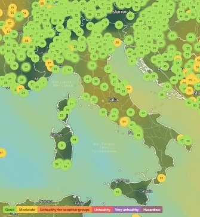
</p>

- Forse [Google Maps](https://www.google.it/maps/@40.8851745,13.554191,6z/data=!5m1!1e9?hl=it&entry=ttu&g_ep=EgoyMDI1MDQyMi4wIKXMDSoASAFQAw%3D%3D) riesce a fare ancora peggio, non espone alcuna centralina ma si limita a pubblicare una cartina colorata che, al momento della rilevazione esprime, per la città di Brindisi, un giudizio di "discreta".

<p align="center">
  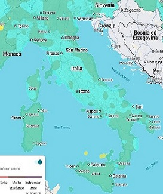
  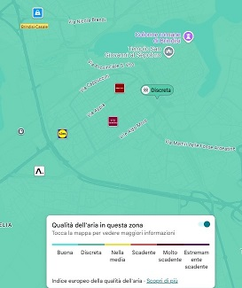
</p>


- [Waqi](https://waqi.info/#/c/5.361/7.189/2.7z) è considerato da molti uno dei siti più affidabili. Anche Waqi come IqAir non espone moltissime centraline in Italia:
<p align="center">
  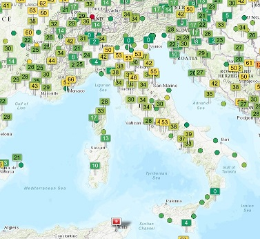
</p>


ma la situazione più preoccupante è la qualità del dato. Per città fortemente espsote agli inquinanti e monitorate sia pubblicamente che privatamente, come Brindisi e Taranto, non dispongono di dati, mentre, per piccoli paesi della provincia leccese ne compaiono anche più di dieci: 
<p align="center">
  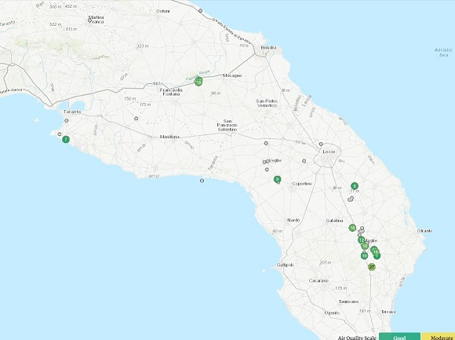
</p>

La cosa mi ha incuriosito molto, così ho deciso di approfondire il discorso cercando di capire soprattutto come sia possibile che a distanza di 3,5 km possano verificarsi situazioni come quelle che vedete di seguito:
<p align="center">
  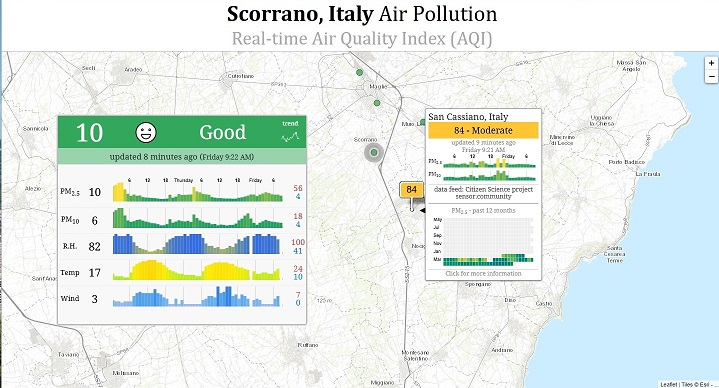
</p>

Così ho scoperto che le centraline adottate da Waqi, denominate **_"sensor.community"_** sono centraline autocostruite, con sistemi ESP32 o NodeMcu, i cui dati sono messi a disposizione sul loro [sito](https://sensor.community/it/) dedicato e la cui mappa corrisponde perfettamente con quella del sito Waqi:


<p align="center">
  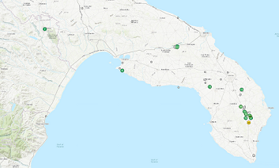
  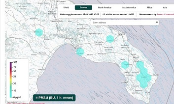
</p>

In conclusione, quindi, sono andato alla ricerca dei dati ufficiali scoprendo che i dati acquisiti dalle ARPA regionali mediante le centraline installate sul territorio, sono pubblicati con cadenza giornaliera ed aggiornati al giorno precedente. Essi sono inoltre "filtrati". Ecco il link ai progetti per la Puglia da me realizzati:

- [Implementazione in Home Assistant tramite Node-RED](https://github.com/kapkirk/Dati-ambientali-ARPA-Puglia-via-Home-Assistant-e-NodeRED)
- [Implementazione in Home Assistant tramite Node-RED ed MQTT](https://github.com/kapkirk/Dati-ambientali-ARPA-Puglia-via-Home-Assistant)

I dati delle ARPA Regionali vengono però inviati con cadenza oraria all'ISPRA che li pubblica, come li definiscono loro, in "quasi tempo reale" e senza alcuna preventiva filtrazione:

<p align="center">
  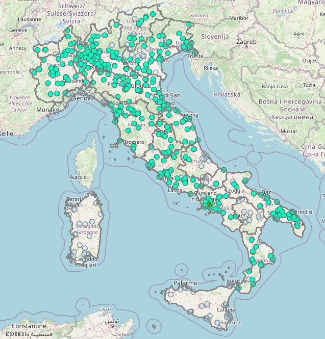
</p>

Ecco spiegata la natura di questo progetto: ottenere un dato di qualità dell'aria basato su dati concreti, reali ed affidabili in tempo reale!

Nella prima scheda che utilizzo in HA, questi dati, mediante schede a scomparsa, oltre a visualizzare il dato sintetito di qualità dell'aria unitamente altri di mio interesse:

<p align="center">
  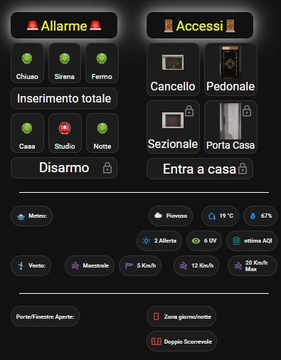
  
</p>

mi cosente di ricevere un alert, sulla stessa maschera, quando uno degli inquinanti supera il livello massimo previsto:

<p align="center">
  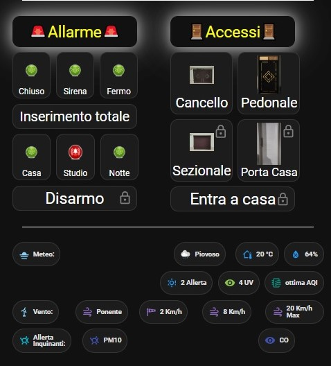
</p>
---

## Caratteristiche principali

- **API Integration**: Collegamento diretto alle API di ISPRA per il prelievo di dei seguenti parametri ambientali:
     1.  **PM10** (Polveri inalabili. Insieme di sostanze solide e liquide con diametro inferiore a 10 micron. Derivano  da emissioni di autoveicoli, processi industriali, fenomeni naturali)
     1.  **PM2.5** (Polveri respirabili. Insieme di sostanze solide e liquide con diametro inferiore a 2.5 micron. Derivano  da processi industriali, processi di combustione, emissioni di autoveicoli, fenomeni naturali)
     3.  **NO2** (Biossido di azoto. Gas tossico che si forma nelle combustioni ad alta temperatura. Sue principali sorgenti sono i motori a scoppio, gli impianti termici, le centrali termoelettriche)
     4.  **SO2** (Biossido di zolfo. Gas irritante, si forma soprattutto in seguito all`utilizzo di combustibili (carbone, petrolio, gasolio) contenenti impurezze di zolfo)
     5.  **CO** (Monossido di Carbonio. Sostanza gassosa, si forma per combustione incompleta di materiale organico, ad esempio nei motori degli autoveicoli e nei processi industriali)
     6.  **C6H6** (Benzene. Liquido volatile e dall`odore dolciastro. Deriva dalla combustione incompleta del carbone e del petrolio, dai gas esausti dei veicoli a motore, dal fumo di tabacco)
     7.  **O3** (Ozono. Sostanza non emessa direttamente in atmosfera, si forma per reazione tra altri inquinanti, principalmente NO2 e idrocarburi, in presenza di radiazione solare)
    

## Descrizione del Funzionamento

1. **Acquisizione Dati**:  
   Ogni ora Home Assistant, mediante una interrogazione acquisisce i dati aggiornati, li filtra e restituisce il valore aggiornato del singolo inquinante.

2. **Elaborazione**:  
   I dati vengono analizzati e restituiti sia singolarmente che in modo aggregato fornendo un giudizio di qualità dell'aria. 

3. **Invio a Home Assistant**:  
   Tutti i dati acquisiti sono pubblicati come elementi dei singoli sensori direttamente esposti in HA.

5. **Visualizzazione**:  
   I dati dati così ottenuti sono graficamente esposti.

---

## Installazione

### 1 - Prerequisiti

- Abilitazione dei  **`packages`** e degli **`scripts python`**:
   - in HA aprire il file **`configuration.yaml`** mediante un editor di testo:   
      - inserire il seguente codice se già non presente:
      
      codice:
      ```
      homeassistant:
        packages: !include_dir_named packages
      
      python_script: 
      ```

- HACS installato e configurato con i seguenti pacchetti installati:
  - la custom  `flex-table-card` (Se volete utilizzare la tabella di visualizzazione come ho fatto io).


### 2 - Configurazione dei dati da acquisire

1.Come già anticipato i dati sono acquisiti tramite le API pubbliche messe a disposizione dalle ARPA mediante l'ISPRA. Le centraline disponibili (dato aggiornato al 9/4/2025) sono le seguenti:

|Regione|             Inquinante                                     |  
| -------- | -------------------------------------------------------- | 
ABRUZZO|Sulphur dioxide (air)|ABRUZZO - Sulphur dioxide (air)
ABRUZZO|Carbon monoxide (air)|ABRUZZO - Carbon monoxide (air)
ABRUZZO|Benzene (air)|ABRUZZO - Benzene (air)
ABRUZZO|Particulate matter < 10 µm (aerosol)|ABRUZZO - Particulate matter < 10 µm (aerosol)
ABRUZZO|Particulate matter < 2.5 µm (aerosol)|ABRUZZO - Particulate matter < 2.5 µm (aerosol)
ABRUZZO|Ozone (air)|ABRUZZO - Ozone (air)
ABRUZZO|Nitrogen dioxide (air)|ABRUZZO - Nitrogen dioxide (air)
BASILICATA|Sulphur dioxide (air)|BASILICATA - Sulphur dioxide (air)
BASILICATA|Carbon monoxide (air)|BASILICATA - Carbon monoxide (air)
BASILICATA|Benzene (air)|BASILICATA - Benzene (air)
BASILICATA|Particulate matter < 10 µm (aerosol)|BASILICATA - Particulate matter < 10 µm (aerosol)
BASILICATA|Particulate matter < 2.5 µm (aerosol)|BASILICATA - Particulate matter < 2.5 µm (aerosol)
BASILICATA|Ozone (air)|BASILICATA - Ozone (air)
BASILICATA|Nitrogen dioxide (air)|BASILICATA - Nitrogen dioxide (air)
CALABRIA|Sulphur dioxide (air)|CALABRIA - Sulphur dioxide (air)
CALABRIA|Carbon monoxide (air)|CALABRIA - Carbon monoxide (air)
CALABRIA|Benzene (air)|CALABRIA - Benzene (air)
CALABRIA|Particulate matter < 10 µm (aerosol)|CALABRIA - Particulate matter < 10 µm (aerosol)
CALABRIA|Particulate matter < 2.5 µm (aerosol)|CALABRIA - Particulate matter < 2.5 µm (aerosol)
CALABRIA|Ozone (air)|CALABRIA - Ozone (air)
CALABRIA|Nitrogen dioxide (air)|CALABRIA - Nitrogen dioxide (air)
CAMPANIA|Sulphur dioxide (air)|CAMPANIA - Sulphur dioxide (air)
CAMPANIA|Carbon monoxide (air)|CAMPANIA - Carbon monoxide (air)
CAMPANIA|Benzene (air)|CAMPANIA - Benzene (air)
CAMPANIA|Particulate matter < 10 µm (aerosol)|CAMPANIA - Particulate matter < 10 µm (aerosol)
CAMPANIA|Particulate matter < 2.5 µm (aerosol)|CAMPANIA - Particulate matter < 2.5 µm (aerosol)
CAMPANIA|Ozone (air)|CAMPANIA - Ozone (air)
CAMPANIA|Nitrogen dioxide (air)|CAMPANIA - Nitrogen dioxide (air)
EMILIA ROMAGNA|Sulphur dioxide (air)|EMILIA_ROMAGNA - Sulphur dioxide (air)
EMILIA ROMAGNA|Carbon monoxide (air)|EMILIA_ROMAGNA - Carbon monoxide (air)
EMILIA ROMAGNA|Benzene (air)|EMILIA_ROMAGNA - Benzene (air)
EMILIA ROMAGNA|Particulate matter < 10 µm (aerosol)|EMILIA_ROMAGNA - Particulate matter < 10 µm (aerosol)
EMILIA ROMAGNA|Particulate matter < 2.5 µm (aerosol)|EMILIA_ROMAGNA - Particulate matter < 2.5 µm (aerosol)
EMILIA ROMAGNA|Ozone (air)|EMILIA_ROMAGNA - Ozone (air)
EMILIA ROMAGNA|Nitrogen dioxide (air)|EMILIA_ROMAGNA - Nitrogen dioxide (air)
FRIULI VENEZIA GIULIA|Sulphur dioxide (air)|FRIULI_VENEZIA_GIULIA - Sulphur dioxide (air)
FRIULI VENEZIA GIULIA|Carbon monoxide (air)|FRIULI_VENEZIA_GIULIA - Carbon monoxide (air)
FRIULI VENEZIA GIULIA|Benzene (air)|FRIULI_VENEZIA_GIULIA - Benzene (air)
FRIULI VENEZIA GIULIA|Particulate matter < 10 µm (aerosol)|FRIULI_VENEZIA_GIULIA - Particulate matter < 10 µm (aerosol)
FRIULI VENEZIA GIULIA|Particulate matter < 2.5 µm (aerosol)|FRIULI_VENEZIA_GIULIA - Particulate matter < 2.5 µm (aerosol)
FRIULI VENEZIA GIULIA|Ozone (air)|FRIULI_VENEZIA_GIULIA - Ozone (air)
FRIULI VENEZIA GIULIA|Nitrogen dioxide (air)|FRIULI_VENEZIA_GIULIA - Nitrogen dioxide (air)
LAZIO|Sulphur dioxide (air)|LAZIO - Sulphur dioxide (air)
LAZIO|Carbon monoxide (air)|LAZIO - Carbon monoxide (air)
LAZIO|Benzene (air)|LAZIO - Benzene (air)
LAZIO|Particulate matter < 10 µm (aerosol)|LAZIO - Particulate matter < 10 µm (aerosol)
LAZIO|Particulate matter < 2.5 µm (aerosol)|LAZIO - Particulate matter < 2.5 µm (aerosol)
LAZIO|Ozone (air)|LAZIO - Ozone (air)
LAZIO|Nitrogen dioxide (air)|LAZIO - Nitrogen dioxide (air)
LIGURIA|Sulphur dioxide (air)|LIGURIA - Sulphur dioxide (air)
LIGURIA|Carbon monoxide (air)|LIGURIA - Carbon monoxide (air)
LIGURIA|Benzene (air)|LIGURIA - Benzene (air)
LIGURIA|Particulate matter < 10 µm (aerosol)|LIGURIA - Particulate matter < 10 µm (aerosol)
LIGURIA|Particulate matter < 2.5 µm (aerosol)|LIGURIA - Particulate matter < 2.5 µm (aerosol)
LIGURIA|Ozone (air)|LIGURIA - Ozone (air)
LIGURIA|Nitrogen dioxide (air)|LIGURIA - Nitrogen dioxide (air)
LOMBARDIA|Sulphur dioxide (air)|LOMBARDIA - Sulphur dioxide (air)
LOMBARDIA|Carbon monoxide (air)|LOMBARDIA - Carbon monoxide (air)
LOMBARDIA|Benzene (air)|LOMBARDIA - Benzene (air)
LOMBARDIA|Particulate matter < 10 µm (aerosol)|LOMBARDIA - Particulate matter < 10 µm (aerosol)
LOMBARDIA|Particulate matter < 2.5 µm (aerosol)|LOMBARDIA - Particulate matter < 2.5 µm (aerosol)
LOMBARDIA|Ozone (air)|LOMBARDIA - Ozone (air)
LOMBARDIA|Nitrogen dioxide (air)|LOMBARDIA - Nitrogen dioxide (air)
MARCHE|Sulphur dioxide (air)|MARCHE - Sulphur dioxide (air)
MARCHE|Carbon monoxide (air)|MARCHE - Carbon monoxide (air)
MARCHE|Benzene (air)|MARCHE - Benzene (air)
MARCHE|Particulate matter < 10 µm (aerosol)|MARCHE - Particulate matter < 10 µm (aerosol)
MARCHE|Particulate matter < 2.5 µm (aerosol)|MARCHE - Particulate matter < 2.5 µm (aerosol)
MARCHE|Ozone (air)|MARCHE - Ozone (air)
MARCHE|Nitrogen dioxide (air)|MARCHE - Nitrogen dioxide (air)
MOLISE|Sulphur dioxide (air)|MOLISE - Sulphur dioxide (air)
MOLISE|Carbon monoxide (air)|MOLISE - Carbon monoxide (air)
MOLISE|Benzene (air)|MOLISE - Benzene (air)
MOLISE|Particulate matter < 10 µm (aerosol)|MOLISE - Particulate matter < 10 µm (aerosol)
MOLISE|Particulate matter < 2.5 µm (aerosol)|MOLISE - Particulate matter < 2.5 µm (aerosol)
MOLISE|Ozone (air)|MOLISE - Ozone (air)
MOLISE|Nitrogen dioxide (air)|MOLISE - Nitrogen dioxide (air)
PIEMONTE|Sulphur dioxide (air)|PIEMONTE - Sulphur dioxide (air)
PIEMONTE|Carbon monoxide (air)|PIEMONTE - Carbon monoxide (air)
PIEMONTE|Benzene (air)|PIEMONTE - Benzene (air)
PIEMONTE|Particulate matter < 10 µm (aerosol)|PIEMONTE - Particulate matter < 10 µm (aerosol)
PIEMONTE|Particulate matter < 2.5 µm (aerosol)|PIEMONTE - Particulate matter < 2.5 µm (aerosol)
PIEMONTE|Ozone (air)|PIEMONTE - Ozone (air)
PIEMONTE|Nitrogen dioxide (air)|PIEMONTE - Nitrogen dioxide (air)
PUGLIA|Sulphur dioxide (air)|PUGLIA - Sulphur dioxide (air)
PUGLIA|Carbon monoxide (air)|PUGLIA - Carbon monoxide (air)
PUGLIA|Benzene (air)|PUGLIA - Benzene (air)
PUGLIA|Particulate matter < 10 µm (aerosol)|PUGLIA - Particulate matter < 10 µm (aerosol)
PUGLIA|Particulate matter < 2.5 µm (aerosol)|PUGLIA - Particulate matter < 2.5 µm (aerosol)
PUGLIA|Ozone (air)|PUGLIA - Ozone (air)
PUGLIA|Nitrogen dioxide (air)|PUGLIA - Nitrogen dioxide (air)
SARDEGNA|Sulphur dioxide (air)|SARDEGNA - Sulphur dioxide (air)
SARDEGNA|Carbon monoxide (air)|SARDEGNA - Carbon monoxide (air)
SARDEGNA|Benzene (air)|SARDEGNA - Benzene (air)
SARDEGNA|Particulate matter < 10 µm (aerosol)|SARDEGNA - Particulate matter < 10 µm (aerosol)
SARDEGNA|Particulate matter < 2.5 µm (aerosol)|SARDEGNA - Particulate matter < 2.5 µm (aerosol)
SARDEGNA|Ozone (air)|SARDEGNA - Ozone (air)
SARDEGNA|Nitrogen dioxide (air)|SARDEGNA - Nitrogen dioxide (air)
SICILIA|Sulphur dioxide (air)|SICILIA - Sulphur dioxide (air)
SICILIA|Carbon monoxide (air)|SICILIA - Carbon monoxide (air)
SICILIA|Benzene (air)|SICILIA - Benzene (air)
SICILIA|Particulate matter < 10 µm (aerosol)|SICILIA - Particulate matter < 10 µm (aerosol)
SICILIA|Particulate matter < 2.5 µm (aerosol)|SICILIA - Particulate matter < 2.5 µm (aerosol)
SICILIA|Ozone (air)|SICILIA - Ozone (air)
SICILIA|Nitrogen dioxide (air)|SICILIA - Nitrogen dioxide (air)
TOSCANA|Sulphur dioxide (air)|TOSCANA - Sulphur dioxide (air)
TOSCANA|Carbon monoxide (air)|TOSCANA - Carbon monoxide (air)
TOSCANA|Benzene (air)|TOSCANA - Benzene (air)
TOSCANA|Particulate matter < 10 µm (aerosol)|TOSCANA - Particulate matter < 10 µm (aerosol)
TOSCANA|Particulate matter < 2.5 µm (aerosol)|TOSCANA - Particulate matter < 2.5 µm (aerosol)
TOSCANA|Ozone (air)|TOSCANA - Ozone (air)
TOSCANA|Nitrogen dioxide (air)|TOSCANA - Nitrogen dioxide (air)
UMBRIA|Sulphur dioxide (air)|UMBRIA - Sulphur dioxide (air)
UMBRIA|Carbon monoxide (air)|UMBRIA - Carbon monoxide (air)
UMBRIA|Benzene (air)|UMBRIA - Benzene (air)
UMBRIA|Particulate matter < 10 µm (aerosol)|UMBRIA - Particulate matter < 10 µm (aerosol)
UMBRIA|Particulate matter < 2.5 µm (aerosol)|UMBRIA - Particulate matter < 2.5 µm (aerosol)
UMBRIA|Ozone (air)|UMBRIA - Ozone (air)
UMBRIA|Nitrogen dioxide (air)|UMBRIA - Nitrogen dioxide (air)
VALLE AOSTA|Benzene (air)|VALLE_AOSTA - Benzene (air)
VALLE AOSTA|Particulate matter < 10 µm (aerosol)|VALLE_AOSTA - Particulate matter < 10 µm (aerosol)
VALLE AOSTA|Particulate matter < 2.5 µm (aerosol)|VALLE_AOSTA - Particulate matter < 2.5 µm (aerosol)
VALLE AOSTA|Ozone (air)|VALLE_AOSTA - Ozone (air)
VALLE AOSTA|Nitrogen dioxide (air)|VALLE_AOSTA - Nitrogen dioxide (air)
VENETO|Sulphur dioxide (air)|VENETO - Sulphur dioxide (air)
VENETO|Carbon monoxide (air)|VENETO - Carbon monoxide (air)
VENETO|Benzene (air)|VENETO - Benzene (air)
VENETO|Particulate matter < 10 µm (aerosol)|VENETO - Particulate matter < 10 µm (aerosol)
VENETO|Particulate matter < 2.5 µm (aerosol)|VENETO - Particulate matter < 2.5 µm (aerosol)
VENETO|Ozone (air)|VENETO - Ozone (air)
VENETO|Nitrogen dioxide (air)|VENETO - Nitrogen dioxide (air)


Oltre che le Provincie Autonome:

|Regione|             Inquinante                                     |  
| -------- | -------------------------------------------------------- | 
BOLZANO|Sulphur dioxide (air)|PA_BOLZANO - Sulphur dioxide (air)
BOLZANO|Carbon monoxide (air)|PA_BOLZANO - Carbon monoxide (air)
BOLZANO|Benzene (air)|PA_BOLZANO - Benzene (air)
BOLZANO|Particulate matter < 10 µm (aerosol)|PA_BOLZANO - Particulate matter < 10 µm (aerosol)
BOLZANO|Particulate matter < 2.5 µm (aerosol)|PA_BOLZANO - Particulate matter < 2.5 µm (aerosol)
BOLZANO|Ozone (air)|PA_BOLZANO - Ozone (air)
BOLZANO|Nitrogen dioxide (air)|PA_BOLZANO - Nitrogen dioxide (air)
TRENTO|Sulphur dioxide (air)|PA_TRENTO - Sulphur dioxide (air)
TRENTO|Carbon monoxide (air)|PA_TRENTO - Carbon monoxide (air)
TRENTO|Benzene (air)|PA_TRENTO - Benzene (air)
TRENTO|Particulate matter < 10 µm (aerosol)|PA_TRENTO - Particulate matter < 10 µm (aerosol)
TRENTO|Particulate matter < 2.5 µm (aerosol)|PA_TRENTO - Particulate matter < 2.5 µm (aerosol)
TRENTO|Ozone (air)|PA_TRENTO - Ozone (air)
TRENTO|Nitrogen dioxide (air)|PA_TRENTO - Nitrogen dioxide (air)


1. La procedura da seguire per individuare il dato è la seguente:
- Accedere alla pagine del [download](https://sinacloud.isprambiente.it/portal/apps/experiencebuilder/experience/?data_id=dataSource_137-infoariadowload_7094-infoariadowload%3A127&draft=true&id=df677d20871d4383b34ce355e24f0598&page=page_74)
- Selezionare la Regione della quale si vuole acquisire il dato inquinante ed individuare il rigo dell'inquinante. Il terzo campo della tabella conterrà il link per il download che bisognerà copiare per inserirlo nel flusso di Node-RED.
  
  Ad esempio, volendo conoscere il dato di **_SO2_** per la Regione Abruzzo, otterremo il seguente link:

    `https://sdi.isprambiente.it/geoserver/infoaria/ows?service=WFS&version=1.0.0&request=GetFeature&typeName=infoaria%3Adati_nrt_informambiente_mv&CQL_FILTER=region_name=%27ABRUZZO%27+AND+pollutant_id=%271%27&maxFeatures=10000&outputFormat=csv `

   può essere utilizzato anche nel normale browser. La sua consultazione genererà il download di un file che potrete leggere ed apprezzare soprattutto perchè per la centralina che avrete individuato, vi consentirà di sapere quali sono i dati pubblicati da ISPRA.

  Ma quale è la centralina che ci interessa? Le soluzioni sono due:
1. individuarla tramite la [mappa](https://sinacloud.isprambiente.it/portal/apps/experiencebuilder/experience/?draft=true&id=df677d20871d4383b34ce355e24f0598&page=page_62):
     - ci colleghiamo al sito ISPRA
     - selezioniamo l`inquinante che ci interessa
     - clicchiamo sulla casella dati orari e vedremo comparire tutte le centraline che esopngono il dato
     - cliccandoci sopra vedremo come primo dato il codice europeo, proprio quello che ci serve (es: IT1659A), prendetene nota!
       
2. Individuarla tramite il file csv:
     - scaricate il file csv come spiegato al precedente punto 1
     - aprite Excel
     - nella scheda del menu `dati` selezionate `txt\csv`
     - selezionate il file, cliccate sempre continua ed importate i dati
     - cercate la centralina che vi interessa tramite l`indirizzo o le coordinate
     - individuate il dato riportato nella colonna campo `station_eu_code`  (es: IT1659A), prendetene nota!
       
    
### 3 - Configurazione in Home Assistant

Dato per assodato che abbiamo superato il primo step dei prerequisiti, l'installazione del progetto è abbatstanza facile perchè ho racchiuso quasi tutto in un _package_, bisognerà procedere come segue:
- Scaricate il pacchetto intero del progetto da github;
- copiate nella cartella principale del **_`config`_** di HA le cartelle _**`python_script`**_, _**`packages`**_ e _**`dati_ispra`**_, oppure, inserite singolarmente i files al loro interno nelle cartelle che già avete.


### 4 - Personalizzazione

Dato aver copiato tutti i files, oppure prima di farlo se preferite, passiamo alla loro modifica:
- Aprite con l'editor il file che ora sarà presente nella cartella **_packages_** denominato **_`pkg_ispra.yaml`_**. Nella sezione _**`setting`**_ del file inserite i link per scaricare gli inquinanti ottenuti come indicati sopra, esattamente qui:

<p align="center">
  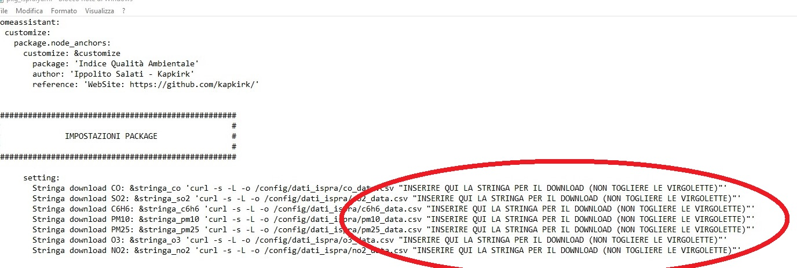
</p>


- Aprite con l'editor il file nella cartella **_python_scripts_** denominato **_`ispra.py`_**. All'interno di esso potrete distinguere una sezione per ogni inquinante. Nella prima riga di ogni inquinante dovrete inserire il codice europeo della stazione acquisito come sopra descritto, esattamente qui:

<p align="center">
  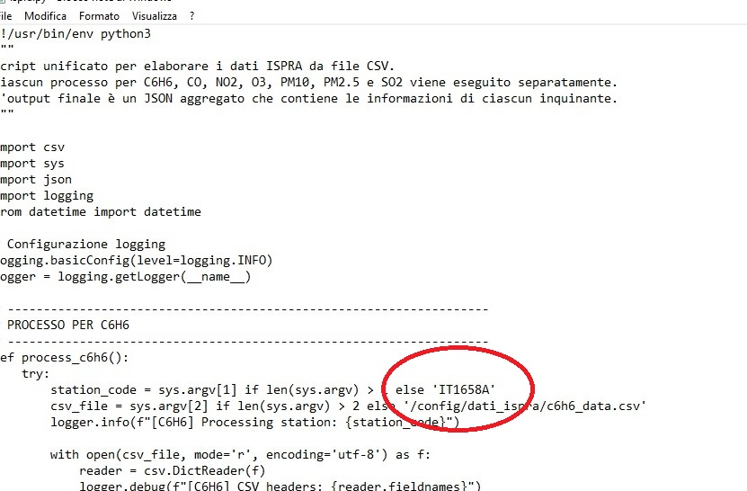
</p>

La personalizzazione del codice è terminata.


### 5 - Configurazione Lovelace di Home Assistant

Il codice sopra inserito, dopo il riavvio di HA ed il primo aggiornamento dei sensori, generà:
- Sette sensori, uno per ogni inquinante (sensor.co_ispra, sensor.so2_ispra, sensor.c6h6_ispra, sensor.pm10_ispra, sensor.pm25_ispra, sensor.o3_ispra, sensor.no2_ispra):

<p align="center">
  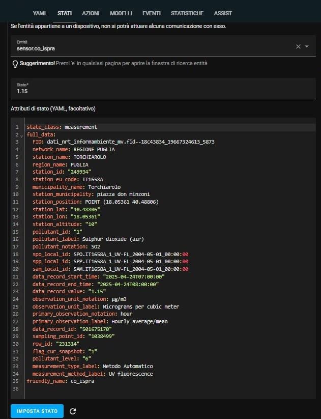
</p>

- un sensore che indicherà un giudizio sintetico sulla qualità dell'aria (sensor.aqi_ispra):

 <p align="center">
  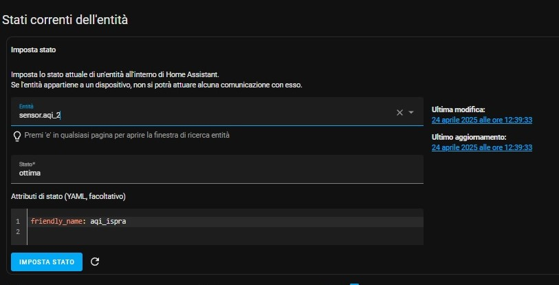
</p>
  
- un pulsante per l'aggiornamento manuale dei dati (input_button.ispra_update);
- una automazione che provvederà all'aggiornamento ogni ora dei sensori (auotmation.update_ispra_sensor)


I sensori sono stati creati e possiamo dunque configurare la scheda Lovelace per la sua visualizzazione. Io ho scelto quella indicata nei prerequisiti anche perchè consente, cliccando sulle intestazioni, di visualizzare i dati secondo l'ordine preferito.

- Nella _Dashbord_ della _lovelace_, dove preferite, aprite una nuova scheda ed incollate il codice del file `HA lovelace dati.txt` ed il risultato sarà questo:

<p align="center">
  
</p>

codice:
```yaml
type: custom:flex-table-card
title: Dati in quasi tempo reale
entities:
  include:
    - sensor.pm10_ispra
    - sensor.pm25_ispra
    - sensor.no2_ispra
    - sensor.co_ispra
    - sensor.o3_ispra
    - sensor.c6h6_ispra
  sort_by: name
columns:
  - name: Inquin.
    data: full_data.pollutant_notation
  - name: Val.
    data: state
  - name: Unità misura
    data: full_data.observation_unit_notation
  - name: Ultima rilevazione
    data: full_data.data_record_end_time
grid_options:
  columns: 15
  rows: 6
```

- Mentre, il sensore con il giudizio di qualità dell'aria  _`sensor.aqi_ispra`_ nella _lovelace_ lo visualizzo come segue:

<p align="center">
  
</p>

  aprite una nuova scheda ed incollate il codice del file `HA lovelace aqi.txt` ed il risultato sarà questo:

codice:
```yaml
type: tile
entity: sensor.aqi
features_position: bottom
vertical: false
name: Qualità dell'Aria
icon: mdi:air-filter
color: primary
tap_action:
  action: none
icon_tap_action:
  action: none
grid_options:
  columns: 10
  rows: 1
```


Il risultato finale sarà il saeguente:

<p align="center">
  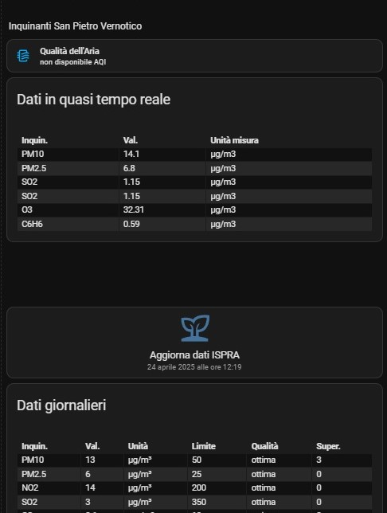
</p>

Ovviamente, avendo a disposizione tutti i dati che costituiscono il sensore, potrete utilizzarli per esporre ciò che più vi piace ricordate solo che gli attributi sono tutti all'intero dei _**full_data.**_, quindi andranno richiamati ed utilizzati così come vedete nel codice della scheda di visualizzazione.

Il pulsante che vedete con l'etichetta (Aggiornamento dati ISPRA) è quello reso disponibile dal **_packages_**  nella configurazione sopra esposta che utilizzo per l'aggiornamento manuale dei dati.

La seconda parte che vedete nella foto, invece, è quella dedicata ai dati ambientali provenienti direttamente da ARPA Puglia. In questo caso, però, i dati sono acquisiti, filtrati e validati dall'Ente che li pubblica con cadenza giornaliera, essi sono riferiti al giorno precedente. 
Se a qualcuno dovessero interessare, questi sono i link ai due progetti:
- [Implementazione in Home Assistant tramite Node-RED](https://github.com/kapkirk/Dati-ambientali-ARPA-Puglia-via-Home-Assistant-e-NodeRED)
- [Implementazione in Home Assistant tramite Node-RED ed MQTT](https://github.com/kapkirk/Dati-ambientali-ARPA-Puglia-via-Home-Assistant)

Questo, invece, è il link ad analogo progetto realizzato con l'ausilio di Node-RED:
- [Implementazione in Home Assistant tramite Node-RED](https://github.com/kapkirk/Indice-di-qualita-dell-aria-via-Home-Assistant-e-NodeRED)


Lavoro finito e buon divertimento! 

Se ti è piaciuto ... lascia una stella.

